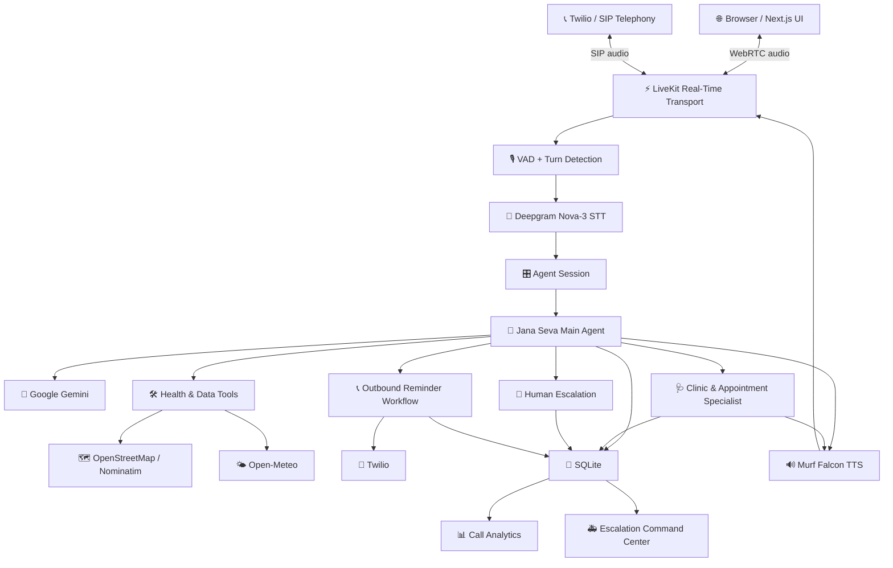
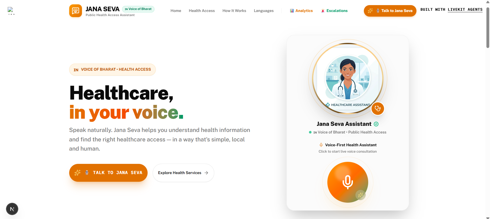
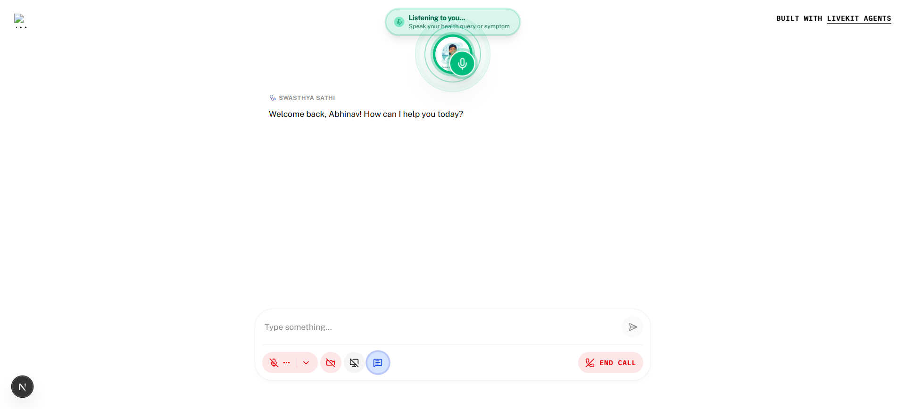
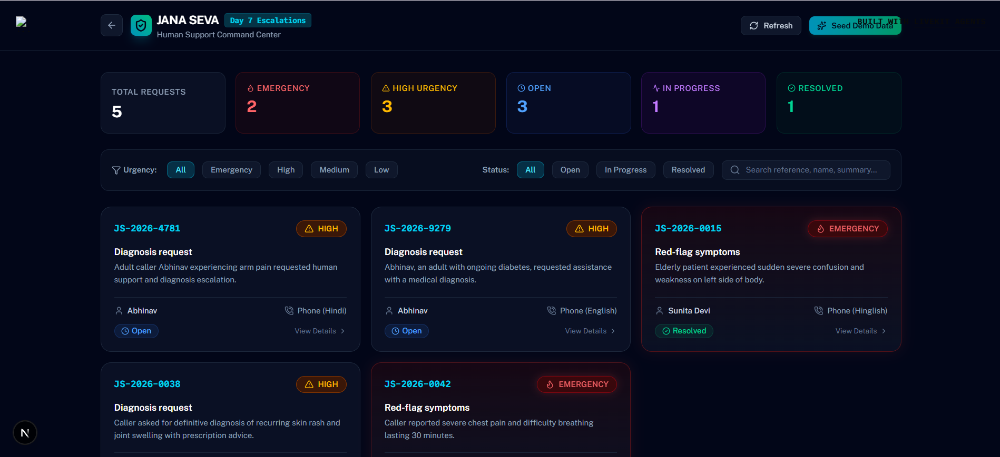
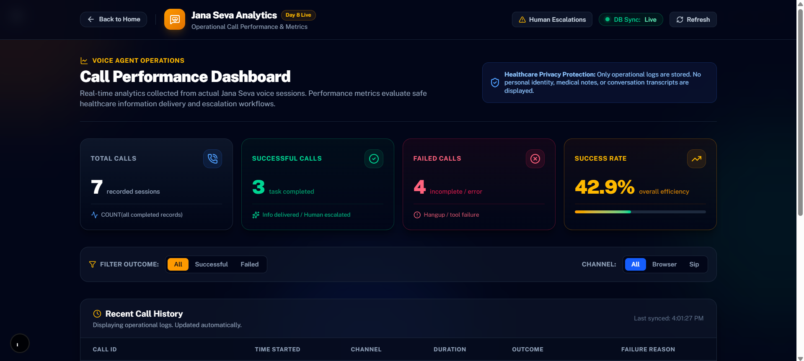
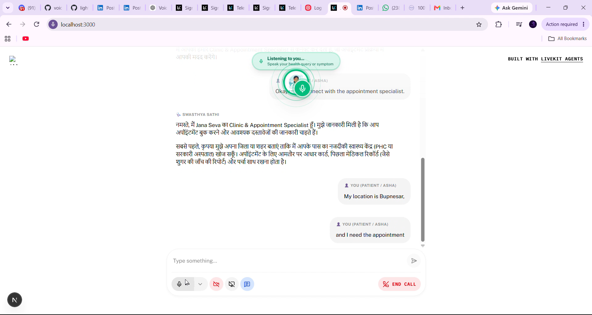

# 🇮🇳 Jana Seva — AI Voice Agent for Health Access

> **Healthcare, in your voice.**
>
> Jana Seva is a voice-first Health Access AI assistant built for the **10 Days of Voice Agents — VoiceForBharat Edition**. It helps users navigate public-health information and healthcare access through natural voice conversations, real-time tools, consent-based human escalation, outbound reminders, call analytics, and specialist-agent handoffs.

**Track:** Health Access  
**Voice:** Murf Falcon  
**Real-time transport:** LiveKit Agents  
**STT:** Deepgram Nova-3  
**LLM:** Google Gemini  
**Frontend:** Next.js / React  
**Backend:** Python / LiveKit Agents  
**Persistence:** SQLite

---

## ✨ What Jana Seva Does

Jana Seva is designed around a simple principle:

> **A voice agent should know not only how to answer, but also when to use real data, when to stop, when to ask for human help, and when another specialist should take over.**

Core capabilities:

- 🎙️ Real-time browser-based voice conversations
- 🇮🇳 Indian voice experience powered by Murf Falcon
- 🧠 Consent-based caller memory
- 🛠️ Real-world healthcare and environmental data tools
- 📍 Nearby PHC / CHC / hospital / Jan Aushadhi lookup
- 🌤️ District-level AQI and environmental health advisory
- 📞 Controlled outbound health-reminder calls
- 🚨 Consent-based human escalation
- 🆔 Escalation reference IDs and urgency levels
- 📊 Real call analytics from SQLite records
- 🔄 Main-agent → specialist-agent handoff
- 🩺 Clinic & Appointment Specialist
- 🌐 English, Hindi and Hinglish interaction paths
- 🔒 Operational dashboards designed to avoid exposing sensitive caller information

---

## 🧭 The 10-Day Journey

| Day | Capability |
|---|---|
| Day 1 | Voice agent foundation |
| Day 2 | Agent objectives, personality and safety boundaries |
| Day 3 | Guardrails and safe health-access behavior |
| Day 4 | Caller memory and returning-user context |
| Day 5 | Real-time domain data tools |
| Day 6 | Controlled outbound calls |
| Day 7 | Human escalation |
| Day 8 | Call analytics dashboard |
| Day 9 | Specialist-agent handoff |
| Day 10 | Project documentation and public build journey |

---

# 🏗️ System Architecture



### Audio path

```text
User microphone
      ↓
LiveKit WebRTC
      ↓
Voice activity / turn detection
      ↓
Deepgram Nova-3
      ↓
Jana Seva Agent
      ↓
Google Gemini + tools
      ↓
Murf Falcon
      ↓
LiveKit
      ↓
User speaker
```

---

# 📸 Project Screenshots

### 1. Jana Seva Homepage



The landing experience introduces Jana Seva as a public-health voice assistant and provides the entry point into the live voice session.

### 2. Live Voice Session



The browser-based agent shows the active listening state, conversation area and live call controls.

### 3. Human Escalation Command Center



The escalation dashboard organizes requests by urgency and status, including emergency, high, open, in-progress and resolved workflows.

> **Privacy note:** This screenshot contains demonstration records. If any displayed names or medical details represent real people rather than synthetic demo data, do not publish this image publicly. Use synthetic demo data before making the repository public.

### 4. Call Analytics Dashboard



The analytics command center shows total calls, successful calls, failed calls and success rate using actual stored call records.

### 5. Specialist Agent Handoff



The main agent announces the handoff and the Clinic & Appointment Specialist continues the conversation with transferred context.

---

# 🛠️ Day 5 — Real-Time Domain Data Tools

Jana Seva uses function-calling tools to obtain useful health-access and environmental information.

## Nearby health facilities

```text
fetch_nearest_phc_facility(
    district,
    facility_type,
    user_id
)
```

It supports lookup of:

- Primary Health Centres
- Community Health Centres
- District Hospitals
- Jan Aushadhi generic medicine stores

The workflow uses OpenStreetMap Nominatim for live lookup and a cached local registry as a fallback.

If the district is already available from the caller's saved context, the tool can reuse it rather than asking the user again.

The tool also includes explicit data timestamps and a spoken fallback path when the live service is unavailable.

## District health advisory

```text
fetch_district_health_advisory(
    district,
    user_id
)
```

The advisory workflow can retrieve:

- AQI
- PM2.5
- PM10
- Temperature
- Respiratory precautions

The source is Open-Meteo's Air Quality and Weather API.

---

# 📞 Day 6 — Controlled Outbound Calls

Jana Seva supports controlled outbound health-reminder workflows such as:

- Vaccination follow-ups
- Medication reminders

The telephony path uses **Twilio + LiveKit SIP outbound trunking**.

### Safety and compliance behavior

The outbound workflow:

1. Identifies Jana Seva.
2. Explains why the call is being made.
3. Gives the user a clear way to opt out.
4. Immediately handles an opt-out request.
5. Records the call outcome.
6. Limits automatic retries.
7. Avoids disclosing sensitive medical information in voicemail.

Supported outcome examples:

```text
ANSWERED
NO_ANSWER
BUSY
VOICEMAIL
HANGUP
FAILED
OPTED_OUT
REMINDER_MISSING
```

Outbound calls are intended for controlled demonstration/testing and not unsolicited bulk calling.

---

# 🚨 Day 7 — Human Escalation

Jana Seva does not attempt to solve every situation itself.

Two important escalation conditions are:

1. **Red-flag symptoms / emergency situations**
2. **Requests for diagnosis or medical decisions outside the agent's safe scope**

The workflow is designed to:

```text
Detect escalation condition
        ↓
Explain why human help is needed
        ↓
Tell the caller what information will be shared
        ↓
Ask for permission
        ↓
Create concise escalation request
        ↓
Assign urgency + reference ID
        ↓
Explain the next step honestly
```

The human-facing request is intended to contain only useful operational information:

- Who needs help
- What happened
- What the agent already checked
- Urgency
- Language
- Preferred follow-up method

Sensitive information such as passwords, OTPs, PINs, account numbers and unnecessary full transcripts should not be included.

The escalation dashboard shown in the project demo supports:

- Emergency
- High
- Medium
- Low
- Open
- In Progress
- Resolved
- Search by reference / name / summary

---

# 📊 Day 8 — Call Analytics Dashboard

Jana Seva records call outcomes in SQLite and exposes them through an operational dashboard.

## Definition of success

A call is considered **successful** when the caller safely receives the requested health-access information or when Jana Seva correctly identifies the need for human assistance and completes the consent-based escalation workflow.

A call is considered **failed** when it ends before reaching the intended outcome, such as an incomplete task, tool failure, API error or agent error.

## Required dashboard metrics

- **Total Calls**
- **Successful Calls**
- **Failed Calls**

The dashboard also includes a success-rate view and operational call history.

Example database fields:

```text
id
call_id
channel
started_at
ended_at
duration_seconds
outcome
failure_reason
language
```

Possible channels:

```text
browser
sip
```

Possible outcomes:

```text
successful
failed
in_progress
```

The analytics view is designed to expose operational metadata rather than sensitive health information.

---

# 🩺 Day 9 — Specialist Agent Handoff

One agent should not be an expert at everything.

Jana Seva therefore separates the general Health Access agent from a focused:

> **Clinic & Appointment Specialist**

The main agent hands off when the user needs:

- Clinic discovery
- Department navigation
- Appointment assistance

## Handoff flow

```text
User request
     ↓
Jana Seva Main Agent
     ↓
Does this require appointment/clinic specialization?
     ↓
Yes
     ↓
Tell user about handoff
     ↓
handoff_to_clinic_specialist
     ↓
Clinic & Appointment Specialist
     ↓
Continue with transferred context
```

The user does not need to repeat the entire problem.

Transferred context can include:

- User intent
- Language preference
- Known location context
- Appointment intent

Emergency red flags bypass specialist routing and use the human-escalation path instead.

The specialist does not fabricate appointment availability or fake slots.

---

# 🔒 Safety and Privacy Principles

Jana Seva is a Health Access assistant, not a replacement for a qualified medical professional.

The agent is designed to:

- Avoid pretending to diagnose.
- Avoid pretending to prescribe.
- Avoid inventing appointment availability.
- Escalate emergency or out-of-scope situations.
- Ask permission before sharing escalation information.
- Avoid exposing private operational data on public dashboards.
- Keep API credentials outside source control.
- Provide honest failure messages when external tools are unavailable.

### Never commit

```text
.env
.env.local
API keys
API secrets
Twilio auth tokens
LiveKit secrets
Private caller data
Real medical records
Passwords
OTP/PIN information
```

---

# ⚙️ Quickstart

## Prerequisites

- Python 3.10+
- `uv`
- Node.js 18+
- `pnpm`
- LiveKit project
- Murf API key
- Deepgram API key
- Google API key

### Install uv

Windows PowerShell:

```powershell
powershell -ExecutionPolicy ByPass -c "irm https://astral.sh/uv/install.ps1 | iex"
```

macOS/Linux:

```bash
curl -LsSf https://astral.sh/uv/install.sh | sh
```

### Install pnpm

```bash
npm install -g pnpm
```

---

# 🔑 Environment Variables

Create local environment files from the project's `.env.example` files.

Typical backend configuration:

```env
LIVEKIT_URL=your_livekit_url
LIVEKIT_API_KEY=your_livekit_api_key
LIVEKIT_API_SECRET=your_livekit_api_secret

MURF_API_KEY=your_murf_api_key
DEEPGRAM_API_KEY=your_deepgram_api_key
GOOGLE_API_KEY=your_google_api_key
```

For outbound calling, configure the required Twilio and LiveKit SIP variables locally.

**Never place real secrets in this README or in Git.**

---

# ▶️ Running Locally

## Backend

```bash
cd backend
uv sync
uv run python src/agent.py download-files
```

## Frontend

```bash
cd frontend
pnpm install
```

## Start the application

### Windows

```powershell
.\start_app.ps1
```

### macOS/Linux

```bash
chmod +x start_app.sh
./start_app.sh
```

Or run services separately:

```bash
# Terminal 1
livekit-server --dev

# Terminal 2
cd backend
uv run python src/agent.py dev

# Terminal 3
cd frontend
pnpm dev
```

Then open:

```text
http://localhost:3000
```

Allow microphone access and start a conversation with Jana Seva.

---

# 🧪 Analytics Test

From the backend:

```bash
cd backend
uv run pytest tests/test_analytics.py
```

The analytics dashboard is available at:

```text
http://localhost:3000/analytics
```

---

# 📁 Project Structure

```text
murf-livekit-starter/
├── backend/
│   ├── src/
│   │   ├── agent.py
│   │   ├── outbound_call.py
│   │   └── analytics_api.py
│   ├── tests/
│   ├── .env.example
│   └── pyproject.toml
│
├── frontend/
│   ├── app/
│   ├── components/
│   ├── public/
│   └── package.json
│
├── docs/
│   └── screenshots/
│
├── start_app.sh
├── start_app.ps1
└── README.md
```

---

# 🎙️ Voice Configuration

Murf voice configuration is handled in the backend agent.

Example voices available in the original configuration include:

- Anisha — Indian English
- Pooja — Indian English
- Samar — Indian English
- Amara — US English
- Gordon — US English
- Hazel — UK English
- Bertie — UK English

Jana Seva's voice experience is powered by **Murf Falcon**.

---

# 🧠 Model and Speech Pipeline

### Speech-to-text

Deepgram Nova-3 is used for speech recognition and multilingual endpointing.

### LLM

Google Gemini is used for reasoning and tool calling.

### Text-to-speech

Murf Falcon provides the streaming voice output.

### Real-time transport

LiveKit handles the real-time audio session between the browser/telephony layer and the agent.

---

# 📝 Day 9 Demo Script

### Normal request — no handoff

User:

> "What documents do I need to visit a government hospital?"

Jana Seva answers directly.

### Specialist request

User:

> "I want to find a clinic and get help with an appointment for a general consultation."

Main agent:

> "I'll connect you with our Clinic & Appointment Specialist, who can help you with the appointment process."

The specialist then continues:

> "Hi, I'm Jana Seva's Clinic & Appointment Specialist. I understand you're looking for help with a general health consultation appointment. Let's go through the available clinics and next steps."

The user continues without repeating the full request.

---

# 🎥 Demo Evidence

The project includes evidence of:

- Homepage and product positioning
- Live voice interaction
- Human escalation management
- Call analytics
- Specialist-agent handoff

The Day 10 journey also includes a final demonstration video and public project write-up.

---

# 🧩 What I Learned

The biggest lesson from building Jana Seva was that a voice agent is much more than speech-to-text plus an LLM plus text-to-speech.

A useful production-oriented agent needs:

- Clear objectives
- Safety boundaries
- Tool selection
- Memory
- Failure handling
- Human escalation
- Consent
- Observability
- Specialist routing
- Honest communication

The most important design decision was therefore not "How can the agent answer more questions?"

It was:

> **"How can the system safely decide what should happen next?"**

---

# 🚀 Future Improvements

Potential next steps include:

- More verified government health-service integrations
- Better multilingual and code-mixed conversation handling
- More specialist agents
- Better human-support workflow management
- Resolution callbacks
- Duplicate escalation detection
- More detailed operational analytics
- Production-grade authentication and access control
- Stronger evaluation and safety testing

---

# 🏆 10 Days of Voice Agents — VoiceForBharat Edition

Jana Seva was built as part of:

**10 Days of Voice Agents — VoiceForBharat Edition**

The project explores how real-time voice AI can make health-access information easier to navigate while keeping human assistance in the loop when the situation requires it.

---

# 🔗 Technology

- Murf Falcon
- LiveKit Agents
- Python
- Next.js
- React
- Deepgram Nova-3
- Google Gemini
- SQLite
- Twilio
- OpenStreetMap Nominatim
- Open-Meteo

---

# 📄 License

MIT
